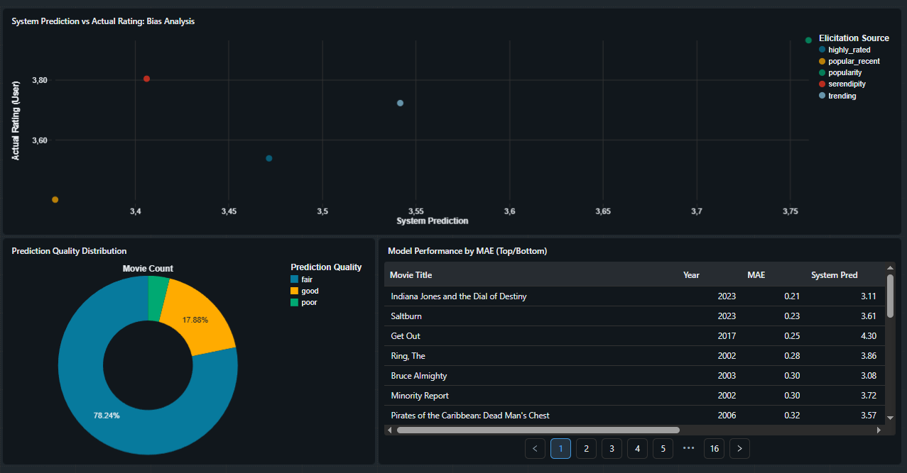
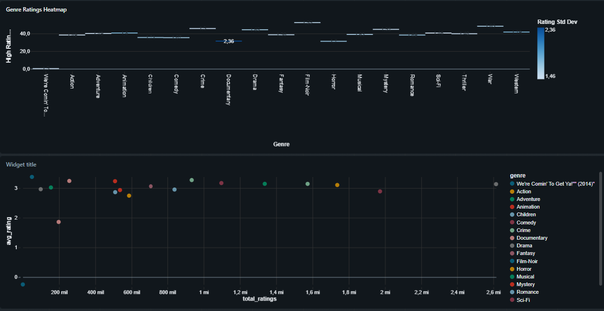
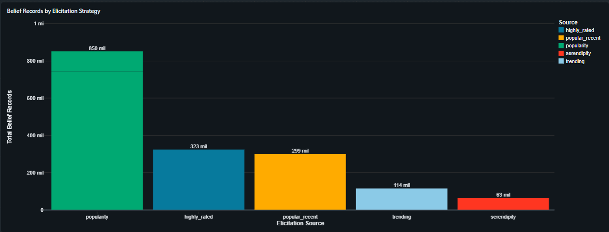

# dbt-Databricks Recommendations Project

Welcome to the dbt-Databricks Recommendations Project! This repository serves as a portfolio project demonstrating modern data engineering practices, transforming raw data into business-ready analytics using **dbt Core** and **Databricks**.

## 🎯 Purpose of this Project

The primary goal of this project is to build a robust, two-tier data pipeline (Silver and Gold layers) for analyzing user behavior and algorithmic recommendation accuracy, inspired by datasets like MovieLens and Netflix.

The project structure takes raw data from a Bronze layer and curates it for final BI consumption:

- **Bronze Layer**: Netflix raw data from [Netflix_Data](https://grouplens.org/datasets/movielens/ml_belief_2024/) located in a volume inside Databricks.
- **Silver Layer**: Cleanses, casts, and normalizes raw data. It handles array unnesting for genres, standardizes user ratings, and parses elicitation strategies.
- **Gold Layer (Business Value)**: Aggregates the cleansed data into wide analytical marts. This layer evaluates the predictive accuracy of the platform's recommendation engine against actual ratings (`gold_system_vs_actual`), evaluates algorithmic bias, tracks user engagement by cohorts (`gold_elicitation_source_summary`), and processes global genre performance (`gold_genre_ratings`).

This architecture prepares the data for dashboards in tools like Tableau, PowerBI, or Databricks SQL.

---

## ⚙️ Configuring Your dbt Profile

To connect this dbt project to your Databricks workspace, you need to configure your `profiles.yml` file. By default, this file is located in your user directory (e.g., `C:\Users\Lucas_Lab\.dbt\profiles.yml` on Windows or `~/.dbt/profiles.yml` on Unix-based systems).

Here is an example configuration for the `databricks_netflix` profile used in this project:

```yaml
databricks_netflix:
  target: dev
  outputs:
    dev:
      type: databricks
      host: dbc-8761621b-b3e3.cloud.databricks.com
      http_path: /sql/1.0/warehouses/22b030c3dfae20c8
      token: <your_personal_access_token>
      catalog: netflix
      schema: 01_bronze
      threads: 4
```

### Configuration Details:

- **`host`**: Your Databricks workspace URL.
- **`http_path`**: The HTTP path to your Databricks SQL Warehouse or cluster.
- **`token`**: Your Databricks Personal Access Token (PAT).
- **`catalog` & `schema`**: The destination Unity Catalog and schema where your dbt models will be materialized.

---

## 🚀 Running the Project & Reflecting Changes in Databricks

Once your profile is configured, you can use the dbt CLI to build, test, and debug your data models. All successful executions will automatically reflect as new or updated tables/views within your Databricks `netflix` catalog.

### 1. Verify the Connection

Before running any transformations, clear out configuration issues by testing the connection to Databricks:

```bash
dbt debug
```

_If everything is configured correctly, all checks will pass, ensuring dbt can communicate with the Databricks SQL Warehouse._

### 2. Build the Transformations

To execute the SQL models and materialize them in Databricks (creating the Silver and Gold tables):

```bash
dbt run
```

\_This command runs the `stg__`and`gold\__` models, applying the transformations and loading the final tables into your Databricks environment.\_

### 3. Run Data Quality Tests

To ensure the integrity of your data (e.g., catching nulls, verifying unique identifiers, or validating expected values):

```bash
dbt test
```

_It is best practice to run `dbt test` frequently to validate that unexpected data hasn't broken the logic of your Silver and Gold layers._

### 4. Build and Test Together

To execute both the build and testing phases sequentially in one command:

```bash
dbt build
```

---

## 📈 Databricks Reports

The generated visualizations and analytical reports can be found inside the `databricks/reports/` directory.

**Algorithm Performance**


**Content Strategy**


**User Engagement & Cohort Tracking**

